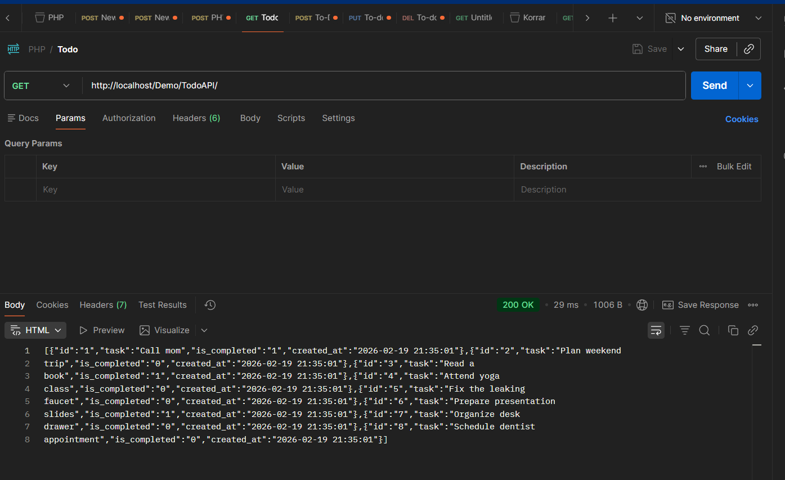
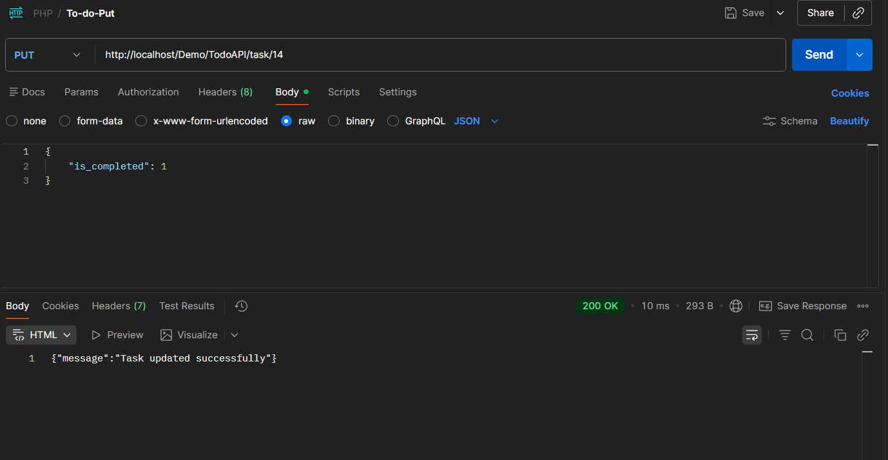

<h1 align="center">

To-Do REST API
</h1>

A RESTful API built with pure PHP and MySQL following MVC architecture principles.

<h2>📌 Project Overview</h2>

This project is a simple To-Do REST API developed using pure PHP.
It allows users to perform full CRUD operations on tasks using HTTP methods.

<ul>
  <li>Create new tasks</li>
  <li>Read all tasks or a single task</li>
  <li>Update existing tasks</li>
  <li>Delete tasks</li>
  <li>JSON-based API responses</li>
  <li>MySQL database integration</li>
</ul>

<h2>🔧 Tech Stack</h2>

<ul>
  <li><strong>PHP 8+</strong></li>
  <li><strong>MySQL</strong></li>
  <li><strong>XAMPP</strong></li>
  <li>REST Architecture</li>
  <li>MVC Pattern</li>
</ul>

<h2 align="center">📸 API Preview (Postman Tests)</h2>

Examples of successful API requests tested using Postman.

 

<table align="center">
  <tr>
    <td align="center">
      <strong>➕ Create Task</strong> 
      
    </td>
    <td align="center">
      <strong>📖 Read Tasks</strong> 
      
    </td>
  </tr>
  <tr>
    <td align="center">
      <strong>✏️ Update Task</strong> 
      
    </td>
    <td align="center">
      <strong>🗑 Delete Task</strong> 
      
    </td>
  </tr>
</table>

 

<h2>📂 Project Structure</h2>

<pre>
TodoAPI/
│
├── config/
│   └── Database.php
│
├── controller/
│   └── TaskController.php
│
├── model/
│   └── Task.php
│
├── assets/
│   └── screenshots/
│
├── index.php
├── .htaccess
└── README.md
</pre>

<h2>🗄 Database Schema</h2>

Create a database (e.g., <strong>todoapi</strong>) and run:

<pre>
CREATE TABLE tasks (
  id INT AUTO_INCREMENT PRIMARY KEY,
  title VARCHAR(255) NOT NULL,
  description TEXT,
  status VARCHAR(50) DEFAULT 'pending',
  created_at TIMESTAMP DEFAULT CURRENT_TIMESTAMP
);
</pre>

<h2>🚀 How to Run Locally</h2>

<ol>
  <li>Clone the repository</li>
  <li>Move the project into your <code>htdocs</code> folder</li>
  <li>Start Apache and MySQL in XAMPP</li>
  <li>Create the database <strong>todoapi</strong></li>
  <li>Update database credentials in <code>config/Database.php</code></li>
  <li>Access via:</li>
</ol>

<pre>
http://localhost/Demo/TodoAPI/
</pre>

<h2>🌐 API Endpoints</h2>

<table>
<tr>
<th>Method</th>
<th>Endpoint</th>
<th>Description</th>
</tr>

<tr>
<td>GET</td>
<td>/tasks</td>
<td>Retrieve all tasks</td>
</tr>

<tr>
<td>GET</td>
<td>/tasks/{id}</td>
<td>Retrieve single task</td>
</tr>

<tr>
<td>POST</td>
<td>/tasks</td>
<td>Create new task</td>
</tr>

<tr>
<td>PUT</td>
<td>/tasks/{id}</td>
<td>Update task</td>
</tr>

<tr>
<td>DELETE</td>
<td>/tasks/{id}</td>
<td>Delete task</td>
</tr>

</table>

<h2>🎯 Learning Objectives</h2>

<ul>
  <li>Understanding RESTful API development in PHP</li>
  <li>Implementing MVC in backend applications</li>
  <li>Handling HTTP methods (GET, POST, PUT, DELETE)</li>
  <li>Working with JSON responses</li>
  <li>Testing APIs using Postman</li>
</ul>

<h2>👩‍💻 Author</h2>

<strong>Leiziane Trevisan Dardin</strong> 
Software Development Student 
Bow Valley College – Calgary, Canada

Built with ❤️ using PHP & MySQL

